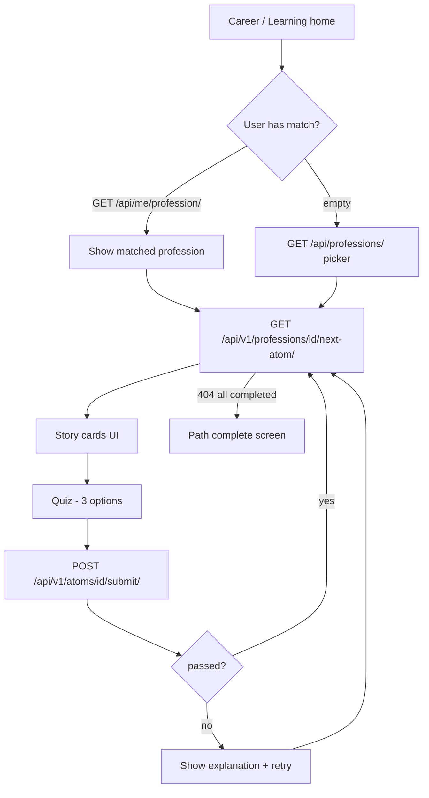

# Frontend integration — Breneo Professions & Atoms API (Django)

Use this document when wiring the React SPA to **career paths** and the **Atoms** micro-learning feature (~3-minute story-card lessons ending in a quiz). Copy it into the frontend repo or paste it as a Cursor agent prompt.

**Single source of truth:** Career paths are **`Profession`** rows only. There is **no** separate `LearningModule` table. Atoms belong to a profession via `profession_id`.

**Removed / do not use:**

- `LearningModule` / `/api/v1/modules/...` — **removed**
- `salary_info` on professions — **removed** from API responses
- `module_id`, `module_title` on atom payloads — use `profession_id`, `profession_title`

---

## Base URL and authentication

| Item | Value |
|------|--------|
| Base URL | Same host as other Breneo API calls (e.g. `https://<django-host>/` or `http://127.0.0.1:8000/`) |
| Auth | `Authorization: Bearer <access_token>` (same JWT as `/api/me/profile/`) |
| Content-Type | `application/json` for POST bodies |
| Trailing slashes | **Required** on every path below |

---

## Mental model

```
Profession (career path)
  └── Atom #1 (sequence_order: 1) → story cards → quiz
  └── Atom #2 (sequence_order: 2) → story cards → quiz
  └── Atom #3 ...
```

- User **cannot skip** atoms — must pass atom N before atom N+1 is submittable.
- **Pass threshold:** quiz score ≥ **80%** (single-question quiz = 100% correct or 0%).
- Failed attempt → `requires_retake: true`; `GET next-atom` returns the **same** atom until passed.
- Progress is stored server-side per user (`UserProgress`); no client-side `user_id` in requests.

---

## Profession object (list / detail shape)

Returned by `GET /api/professions/` and nested under `GET /api/me/profession/`.

| Field | Type | Notes |
|-------|------|--------|
| `id` | number | Profession primary key — use as `profession_id` for atoms |
| `title` | string | e.g. `"Frontend Developer"` |
| `description` | string | Long-form career description |
| `skills` | string[] | Skill names |
| `market_popularity` | `{ year: string; value: number }[]` | Chart data |
| `relevant_courses` | string[] | Course titles |
| `created_at` | string | ISO 8601 |
| `updated_at` | string | ISO 8601 |

**Not returned:** `salary_info` (field removed from backend).

### Example profession

```json
{
  "id": 9,
  "title": "Frontend Developer",
  "description": "Build modern web interfaces...",
  "skills": ["React", "JavaScript", "TypeScript", "UI/UX"],
  "market_popularity": [
    { "year": "2020", "value": 75 },
    { "year": "2021", "value": 78 }
  ],
  "relevant_courses": ["React Bootcamp"],
  "created_at": "2026-01-15T10:00:00Z",
  "updated_at": "2026-03-01T12:00:00Z"
}
```

---

## Atom object (lesson shape)

Returned by `GET /api/v1/professions/{profession_id}/next-atom/`.

| Field | Type | Notes |
|-------|------|--------|
| `id` | number | Atom id — use for `POST .../atoms/{id}/submit/` |
| `profession_id` | number | Parent profession |
| `profession_title` | string | Display label |
| `title` | string | Lesson title |
| `sequence_order` | number | 1-based order within profession |
| `content_cards` | `ContentCard[]` | Story-like slides (see below) |
| `quiz` | `{ options: string[] }` | **No** `correct_index` or `explanation` before submit |

### Content card

| Field | Type | Values |
|-------|------|--------|
| `card_index` | number | 0-based, sequential |
| `content_type` | string | `"markdown"` \| `"code"` \| `"math_formula"` \| `"rich_text"` |
| `content_body` | string | Raw content — render by type |

**Rendering hints:**

| `content_type` | Suggested UI |
|----------------|--------------|
| `markdown` | Markdown renderer |
| `code` | Syntax-highlighted code block (language-agnostic) |
| `math_formula` | KaTeX / MathJax or monospace text |
| `rich_text` | Sanitized HTML or plain text |

### Example atom response

```json
{
  "id": 2,
  "profession_id": 9,
  "profession_title": "Frontend Developer",
  "title": "Semantic HTML Foundations",
  "sequence_order": 1,
  "content_cards": [
    {
      "card_index": 0,
      "content_type": "markdown",
      "content_body": "# Why semantics matter\n\nScreen readers..."
    },
    {
      "card_index": 1,
      "content_type": "code",
      "content_body": "<header>\n  <nav>...</nav>\n</header>"
    }
  ],
  "quiz": {
    "options": [
      "To style elements with CSS classes only",
      "To describe content meaning for browsers and assistive tech",
      "To replace JavaScript event handlers"
    ]
  }
}
```

---

## Quiz submit result

Returned by `POST /api/v1/atoms/{atom_id}/submit/`.

| Field | Type | Notes |
|-------|------|--------|
| `atom_id` | number | |
| `profession_id` | number | |
| `score_percentage` | number | `100.0` or `0.0` (single question) |
| `is_completed` | boolean | `true` if score ≥ 80% |
| `requires_retake` | boolean | `true` if failed — user must retry |
| `passed` | boolean | Same as `is_completed` for current logic |
| `is_correct` | boolean | Selected option matched answer |
| `correct_index` | number | `0`, `1`, or `2` — show after submit |
| `explanation` | string | Show in results UI |
| `last_attempted_at` | string | ISO 8601 |

---

## SPA endpoints (JWT required)

### 1. List all professions (catalog / learning path picker)

```http
GET /api/professions/
Authorization: Bearer <access_token>
```

**Response `200`:** JSON **array** of profession objects (not wrapped in `results`).

**Errors:** `401` — missing or invalid token.

**Frontend:** Use this to populate a “Choose your path” or careers browser. Match user's assigned profession from `/api/me/profession/` when showing a default path.

**Seeded professions with atoms (dev):** Frontend Developer (`id: 9`), UI/UX Designer (`id: 19`), Product Owner (`id: 34`) — IDs may differ per environment; always use `id` from API, not hardcoded.

---

### 2. Current user's matched professions

```http
GET /api/me/profession/
Authorization: Bearer <access_token>
```

**Response `200`:** Array of assignments, newest/highest match first:

```json
[
  {
    "id": 1,
    "profession": {
      "id": 9,
      "title": "Frontend Developer",
      "description": "...",
      "skills": ["React", "JavaScript"],
      "market_popularity": [],
      "relevant_courses": [],
      "created_at": "...",
      "updated_at": "..."
    },
    "match_score": 92.5,
    "created_at": "2026-06-01T08:00:00Z"
  }
]
```

**Empty array `[]`:** User has no profession assignment yet — fall back to manual path selection via `GET /api/professions/`.

---

### 3. Get next atom for a profession (start / resume lesson)

```http
GET /api/v1/professions/{profession_id}/next-atom/
Authorization: Bearer <access_token>
```

**Response `200`:** Atom object (see above).

**Response `404`:**

| `detail` | Meaning | UI action |
|----------|---------|-----------|
| `"Profession not found."` | Invalid `profession_id` | Show error / redirect |
| `"This profession has no atoms yet."` | Path has no content | Empty state |
| `"You have completed all atoms for this profession."` | Path complete | Celebration / next steps |

**Errors:** `401` — unauthorized.

**Frontend flow:**

1. Call on entering a profession's learning screen.
2. Render `content_cards` as swipeable / story slides (Instagram-style).
3. After last card, show `quiz.options` as 3 choices (indices `0`, `1`, `2`).
4. On submit, call endpoint 4 below.

---

### 4. Submit quiz answer

```http
POST /api/v1/atoms/{atom_id}/submit/
Authorization: Bearer <access_token>
Content-Type: application/json
```

**Request body:**

```json
{
  "selected_option_index": 1
}
```

`selected_option_index` must be `0`, `1`, or `2`.

**Response `200`:** Quiz submit result (see above).

**Errors:**

| Status | `detail` | UI action |
|--------|----------|-----------|
| `400` | Validation error / invalid option | Highlight form error |
| `401` | Unauthorized | Re-login |
| `403` | Complete prerequisite atoms before submitting | Should not happen if using `next-atom` |
| `404` | Atom not found | Refresh / go back |
| `500` | Atom quiz data is misconfigured | Generic error |

**After submit UI:**

- **Passed (`passed: true`):** Show `explanation`, celebrate, then `GET next-atom` for the next lesson (or 404 if path complete).
- **Failed (`requires_retake: true`):** Show `explanation` + correct answer (`correct_index`), offer “Try again” → same atom via `GET next-atom`.

---

## Recommended screen flow



---

## TypeScript types (copy-paste)

```typescript
export type ContentType = "markdown" | "code" | "math_formula" | "rich_text";

export interface ContentCard {
  card_index: number;
  content_type: ContentType;
  content_body: string;
}

export interface Profession {
  id: number;
  title: string;
  description: string;
  skills: string[];
  market_popularity: { year: string; value: number }[];
  relevant_courses: string[];
  created_at: string;
  updated_at: string;
}

export interface ProfessionAssignment {
  id: number;
  profession: Profession;
  match_score: number;
  created_at: string;
}

export interface Atom {
  id: number;
  profession_id: number;
  profession_title: string;
  title: string;
  sequence_order: number;
  content_cards: ContentCard[];
  quiz: { options: [string, string, string] };
}

export interface AtomSubmitResult {
  atom_id: number;
  profession_id: number;
  score_percentage: number;
  is_completed: boolean;
  requires_retake: boolean;
  passed: boolean;
  is_correct: boolean;
  correct_index: number;
  explanation: string;
  last_attempted_at: string;
}
```

---

## Fetch helpers (example)

```typescript
const API = import.meta.env.VITE_API_URL; // your Django base

function headers(token: string) {
  return {
    Authorization: `Bearer ${token}`,
    "Content-Type": "application/json",
  };
}

export async function listProfessions(token: string): Promise<Profession[]> {
  const res = await fetch(`${API}/api/professions/`, { headers: headers(token) });
  if (!res.ok) throw new Error(`GET /api/professions/ → ${res.status}`);
  return res.json();
}

export async function getMyProfessions(token: string): Promise<ProfessionAssignment[]> {
  const res = await fetch(`${API}/api/me/profession/`, { headers: headers(token) });
  if (!res.ok) throw new Error(`GET /api/me/profession/ → ${res.status}`);
  return res.json();
}

export async function getNextAtom(
  token: string,
  professionId: number
): Promise<Atom | null> {
  const res = await fetch(
    `${API}/api/v1/professions/${professionId}/next-atom/`,
    { headers: headers(token) }
  );
  if (res.status === 404) return null; // not found / no atoms / all complete
  if (!res.ok) throw new Error(`GET next-atom → ${res.status}`);
  return res.json();
}

export async function submitAtomQuiz(
  token: string,
  atomId: number,
  selectedOptionIndex: 0 | 1 | 2
): Promise<AtomSubmitResult> {
  const res = await fetch(`${API}/api/v1/atoms/${atomId}/submit/`, {
    method: "POST",
    headers: headers(token),
    body: JSON.stringify({ selected_option_index: selectedOptionIndex }),
  });
  if (!res.ok) {
    const err = await res.json().catch(() => ({}));
    throw new Error(err.detail ?? `POST submit → ${res.status}`);
  }
  return res.json();
}
```

---

## UI components to build

| Component | Responsibility |
|-----------|----------------|
| `ProfessionPicker` | Lists professions from `GET /api/professions/` |
| `LearningPathHeader` | Shows `profession_title`, optional progress (derive from completed atoms if you track locally after submits) |
| `AtomStoryViewer` | Horizontal pager / tap-through for `content_cards` by `card_index` |
| `ContentCardRenderer` | Switch on `content_type` for markdown / code / math / rich text |
| `AtomQuiz` | Three radio/button options; disable until user selects |
| `QuizResultModal` | Shows `explanation`, pass/fail, correct answer on failure |
| `PathComplete` | Shown when `GET next-atom` returns 404 with all-completed message |

**Progress bar (optional):** Backend does not expose a “list all atoms + progress” endpoint yet. Options:

- Track locally: after each successful submit, increment completed count (fragile on refresh).
- **Recommended follow-up API** (not implemented): `GET /api/v1/professions/{id}/progress/` — ask backend if needed.

---

## Migration checklist (frontend)

- [ ] Remove any `LearningModule` / `module_id` / `/api/v1/modules/` references
- [ ] Remove `salary_info` from profession types and UI
- [ ] List paths: `GET /api/professions/` (bare array)
- [ ] User match: `GET /api/me/profession/` → `profession.id` for default path
- [ ] Load lesson: `GET /api/v1/professions/{profession_id}/next-atom/`
- [ ] Submit quiz: `POST /api/v1/atoms/{atom_id}/submit/` with `selected_option_index`
- [ ] Render 4 `content_type` variants for story cards
- [ ] Do not show quiz answer before submit — only `quiz.options`
- [ ] On fail, call `next-atom` again to retry same lesson
- [ ] On pass, call `next-atom` for next lesson or show completion on 404

---

## Cursor agent prompt (short)

> Integrate Breneo **Atoms** micro-learning against Django. Career paths are **`Profession`** only — no `LearningModule`, no `salary_info`. Use JWT on all routes; trailing slashes required. List catalog: `GET /api/professions/` (JSON array). User match: `GET /api/me/profession/`. Load next lesson: `GET /api/v1/professions/{profession_id}/next-atom/` → atom with `content_cards[]` (types: `markdown`, `code`, `math_formula`, `rich_text`) and `quiz.options` only (no answer key). Submit: `POST /api/v1/atoms/{atom_id}/submit/` body `{ selected_option_index: 0|1|2 }` → result with `passed`, `explanation`, `correct_index`. Pass threshold 80%. Failed users get same atom on next `next-atom`. Build story-card swiper + quiz + result screen. Full spec: `docs/FRONTEND_ATOMS_API.md` in breneo-api repo.
